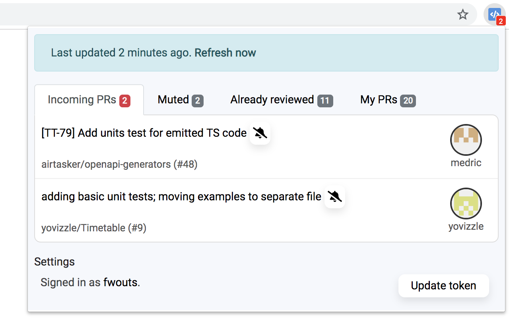

# PR Monitor

  
  

PR Monitor is a Chrome and Firefox extension that notifies you when you receive a pull request on GitHub.

## What does it look like?

Here's a real-life screenshot on Chrome:

  

## How to install

1. Install the [Chrome extension](https://chrome.google.com/webstore/detail/pr-monitor/pneldbfhblmldbhmkolclpkijgnjcmng) or [Firefox extension](https://addons.mozilla.org/en-US/firefox/addon/pr-monitor)
2. [Create a GitHub personal access token with the **repo** permission](https://github.com/settings/tokens)
3. Enter the token into the extension
4. Enjoy

## How to build it yourself

If you don't trust a random Chrome extension on the Internet with your GitHub token, that's understandable.

Here's how to build the extension yourself from source:

1. Install [Yarn](https://yarnpkg.com).
2. Install dependencies with `yarn install`.
3. Run `yarn build`.
4. Install the extension from the generated `dist/` directory in developer mode.

## Feedback

Feel free to [file an issue](https://github.com/zenclabs/prmonitor/issues) with your feedback.
